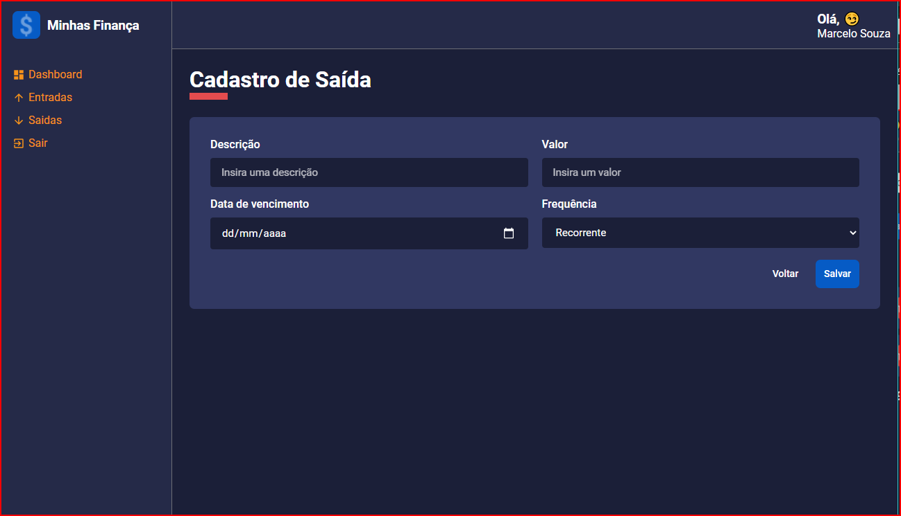

# Aplicação Minhas Finanças

Aplicação para controle de gastos mensais e análise.

curso: https://www.udemy.com/course/react-e-typescript/;
Obs: (O Curso compreende apenas dashboard, tela de entrada e saída outras features e back-end foram desenvolvidos por mim.)

#### Tecnologias utilizadas

#### Back-end:
- Nodejs
- Loopback 4

#### Front-end
- React
- Typescript
- Axios
- Styled-component
- Framer-Motion (Biblioteca para animações e transições)
- React ContUP
- Recharts
- Unform
- React-toastify
- React-confirm-alert

##### Desenvolvido em React e Nodejs.

#### Features Adicionadas até o momento:
- Back-end para população dos dados (Desenvolvido em Loopback 4).
- Cadastro de entradas e saídas (Tela e back-end).
- Remoção de faturas.

#### Prôximas features:
- Cadastro de uma fatura continua, válida para meses subsequentes.
- Login.
- Alteração de tema.

